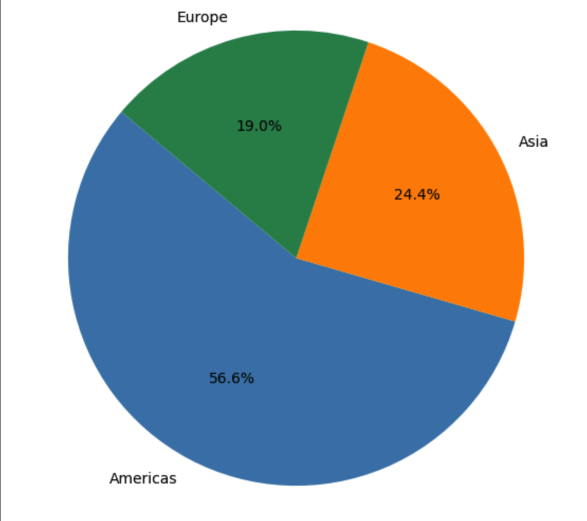
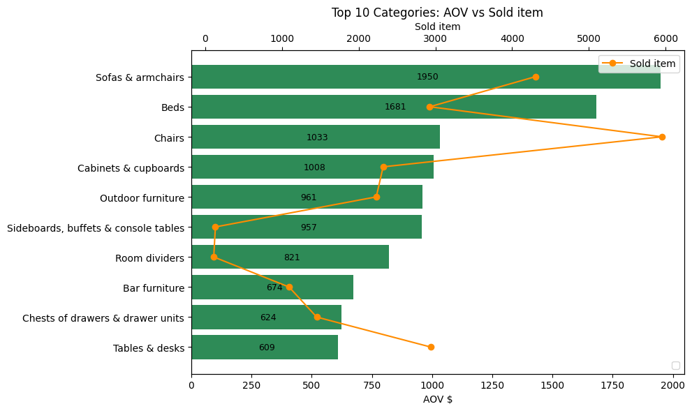
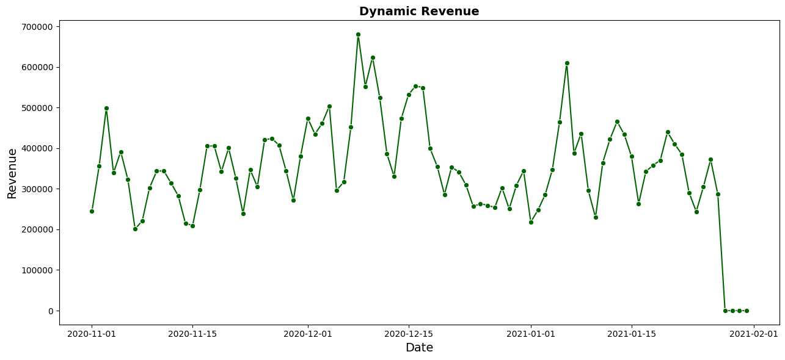
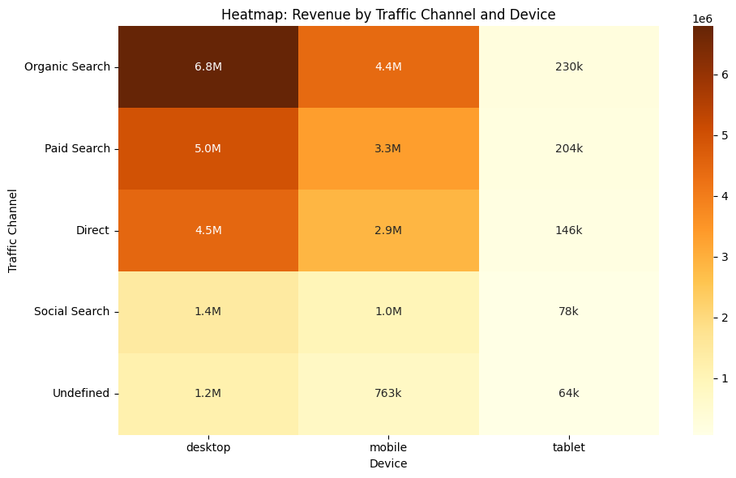
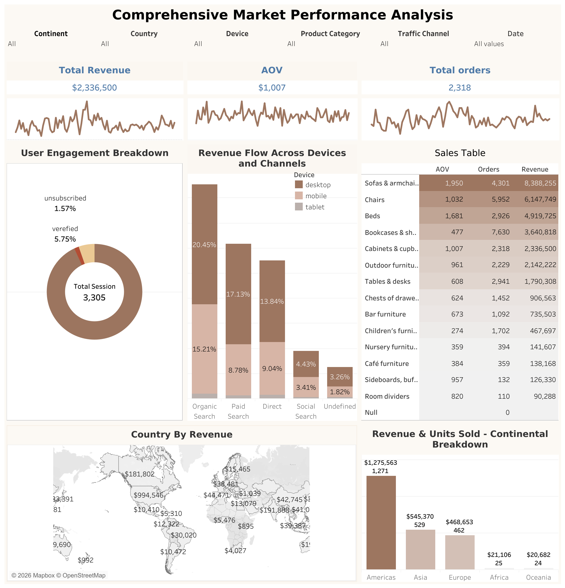

# portfolio-furniture-company-
# Furniture Company - Sales & Marketing Analytics (Portfolio Project)

## Overview
This project analyzes the peak-season performance (November 2020 - January 2021) 
of a global furniture e-commerce company. Using SQL, Python (pandas, matplotlib, 
seaborn, scipy) and Tableau, the analysis covers regional sales performance, 
product category profitability, customer behavior across devices and traffic 
channels, and the effectiveness of the email subscription program. The goal is 
to deliver actionable recommendations for marketing and assortment strategy.

## Tools & Technologies
- **SQL / Google BigQuery** - data extraction and joins across sessions, accounts, orders, and products
- **Python (pandas, numpy)** - data cleaning and exploratory analysis
- **Matplotlib / Seaborn** - data visualization
- **SciPy** - statistical testing (Shapiro-Wilk, Spearman, Pearson, Mann-Whitney U)
- **Tableau** - interactive dashboard

## Dataset
349,545 sessions, 18 columns, covering Nov 1, 2020 – Jan 31, 2021. 
Source: public e-commerce training dataset (`data-analytics-mate.DA`).


```python
registred_acc = sales[sales["is_registered_user"].notnull()]      # session with account
not_registed_acc = sales[sales["is_registered_user"].isnull()]    # anonymous
```

 **Note on terminology:** The `is_registered_user` field represents an account ID linked to a session, not a boolean registration flag. A missing value means the session has no associated account (anonymous session), rather than indicating a user who declined to register. In this analysis, "registered" refers to sessions linked to an account, and "unregistered" refers to fully anonymous sessions. This distinction is important: the comparison reflects account-linked vs. anonymous traffic, not necessarily registered vs. unregistered site visitors in the conventional sense.

## Key Questions Answered
- Which continents and countries generate the most revenue, and through what mechanism (volume vs. AOV vs. conversion)?
- Which product categories drive revenue vs. order volume, and what is the optimal premium/mass-market mix?
- How do device type and traffic channel affect revenue, conversion, and AOV?
- How effective is the email subscription program, and what is its revenue impact?
- Are there statistically significant relationships between sessions, revenue, regions, and user segments?

## Key Findings & Recommendations

- **Geography:** The Americas lead in revenue due to order volume, not AOV. Europe has the highest 
conversion rate but lower volume — a key growth lever. The US is the top revenue 
market (~$13.9M).


*The Americas account for the majority of total revenue, driven by order volume rather than higher AOV.*


Scale revenue in the Americas by optimizing logistics for high order volumes, 
while testing premium segments to lift AOV. Grow Europe's revenue by increasing 
order volume, leveraging its already high conversion rate.


*The US leads in revenue by scale; Germany and Spain show the highest conversion rates — engaged markets with volume growth potential.*

- **Product mix:** Sofas, chairs, and beds drive the most revenue; bookcases drive the most units. A recommended mix is ~60-70% mass-market units paired with ~40-50% revenue share from premium categories, supported by cross-selling.
  
*Sofas and beds carry high AOV but low volume; bookcases and chairs show the opposite — revealing the premium vs. mass-market split.*


### Seasonality & Sales Dynamics
Revenue peaks in late November–December (Black Friday, pre-holiday promotions). 
Paid Search is the most sensitive channel during peak season. Desktop + Americas 
are the main drivers of peak revenue.


*Distinct revenue spikes in late November and December correspond to Black Friday and pre-holiday campaigns; January shows residual demand.*

- **Channels & devices:**
  Desktop drives ~60% of revenue; Organic Search is the leading channel. Mobile is a growth opportunity for mass-market products.
  Focus on Desktop for premium segments (upselling, financing options). Invest in Mobile for mass-market products (discounts, quick deals, bundles). Concentrate seasonal Paid Search budget around the November–December peak.


*Organic Search and Paid Search on Desktop are the dominant revenue combinations; Mobile shows meaningful potential in both channels.*

- **Loyalty/email program:** ~70% of users confirm their email, ~17% unsubscribe. Subscribed users generate 5x more orders and revenue — retention should be prioritized.
 Reduce unsubscribe rates through personalized, segmented campaigns. For 
unsubscribed users, leverage alternative channels (push notifications, targeted 
ads) — they still purchase and spend more per transaction.
 
- **Statistical analysis:** Revenue is strongly and significantly correlated with session volume (Spearman), and revenue trends are synchronized across continents and user segments.

## Dashboard
Interactive Tableau dashboard: 

*Interactive dashboard consolidating all key metrics with dynamic filtering by continent, device, and traffic channel.*

(https://public.tableau.com/app/profile/iryna.savchuk/viz/portfolioproject1_17710125539270/SalesPerfomencForFurtitureCompany?publish=yes)

## Files
- `Portfolio_Project_2_1(2).ipynb` — full analysis notebook (SQL extraction, EDA, visualizations, statistical tests, business recommendations)

## Author
Iryna Savchuk
